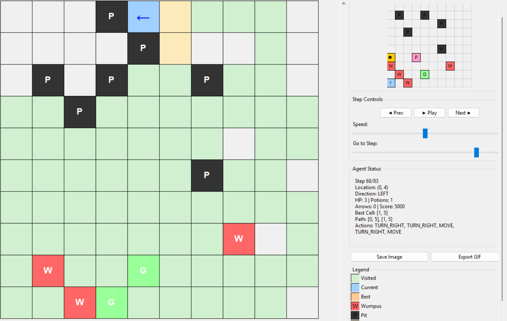
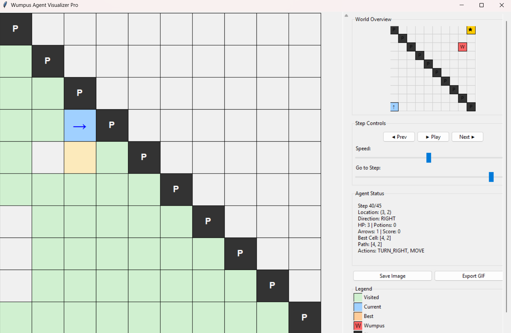

# Wumpus World Agent

An intelligent agent implementation for navigating the classic Wumpus World environment.

## Table of Contents
- [Demo](#demo)
- [Overview](#overview)
- [Project Structure](#project-structure)
- [World Information](#world-information)
- [Percepts](#percepts)
- [Agent Rules](#agent-rules)
- [Features](#features)
- [Visualization](#visualization)
- [How To Run](#how-to-run)

---

## Demo



## Overview
This project simulates an **AI agent** in a dangerous grid-like environment, inspired by the classic Wumpus World problem.

The agent must:
- Use percepts like `BREEZE`, `STENCH`, `GLOW` to reason about hidden hazards.
- Grab the **gold** and return safely.
- Avoid **pits**, **Wumpus**, and **poison gas**, using healing potions when needed.

## Project Structure
``` text
├── agent.py # Main Agent logic (percepts, planning, logging)
├── kb.py # KnowledgeBase using symbolic Z3 logic
├── const.py # Enum definitions for World objects, actions, etc.
├── test.py # Launch the simulation with a chosen map
├── visualize.py # Tkinter-based visualizer from generated logs
├── input/  # Test case world maps
├── output/  # Auto-generated agent_log.jsonl files
└── README.md # You're reading it!
```

## World Information
### World Format (`input/testcase.txt`)
Each map is stored in `input` folder

### Example input file
```text
10
-.-.-.-.-.-.-.-.-.-
-.P.-.-.P.-.-.-.-.-
-.-.-.-.-.-.P.-.-.-
-.-.P.-.-.-.-.-.-.-
-.-.-.-.-.-.-.-.-.-
-.-.-.-.-.-.P.-.-.-
G.-.-.H_P.-.-.-.-.-
W.-.-.-.-.-.W.-.-.-
-.W.-.-.P_G.-.-.-.-
A.-.W.-.-.-.-.-.-.-
```

Each world is described in a simple grid format. The first line is always the board size (`10` for 10×10). Each cell is separated by `.` and may contain multiple symbols:

| Symbol  | Meaning            |
|---------|--------------------|
| `A`     | Agent start        |
| `G`     | Gold               |
| `W`     | Wumpus             |
| `P`     | Pit (deadly)       |
| `H_P`   | Healing Potion     |
| `P_G`   | Poison Gas         |
| `-`     | Empty cell         |

### Percepts

| Percept  | Triggered By         |
|----------|----------------------|
| `BREEZE` | Adjacent to a Pit    |
| `STENCH` | Adjacent to Wumpus   |
| `WHIFF`  | Adjacent to Poison Gas |
| `GLOW`   | Adjacent to Potion   |

## Features
- Agent with decision-making capabilities
- Wumpus World environment simulation
- Perception system (stench, breeze, glow, whiff)
- Knowledge representation and reasoning

## Agent Rules
- Starts at `(9, 0)` with:
  - 4 HP
  - 1 Arrow
  - Score = 0
- Uses:
  - Symbolic reasoning with Z3 to infer safe/unsafe cells
  - Heuristic-based ranking to choose next moves
- Can:
  - **Shoot** Wumpus if position is inferred and facing direction is correct
  - **Use potion** if HP is low
  - **Return to start** and `CLIMB` out when no safe moves remain

## Visualization

A fully interactive Tkinter GUI to inspect each step in the simulation.

| Feature                        | Description |
|-------------------------------|-------------|
| 🔁 Play / pause               | Replay full session step-by-step
| 🗺️ Mini world map             | World overview with object positions
| 🔍 Zoom & pan                | Inspect large boards or areas
| 🖱️ Scrollable sidebar        | All agent status, legend, controls
| 🧭 Directional symbols        | Shows which way agent is facing
| ⚠️ Alerts and event log      | Shows important events like gold collected, gas damage, death

---

## How to Run

### 1. Install Requirements

```bash
pip install pillow
pip install tkinter
pip install z3-solver
```

### 2. Create test case
- Create test case in folder `input/`.

### 3. Run `test.py`
- In `test.py`, change testcase name and run this file.

### 4. Run `visualize.py`
- Run `visualize.py` file and choose the json output file in `output/`.
